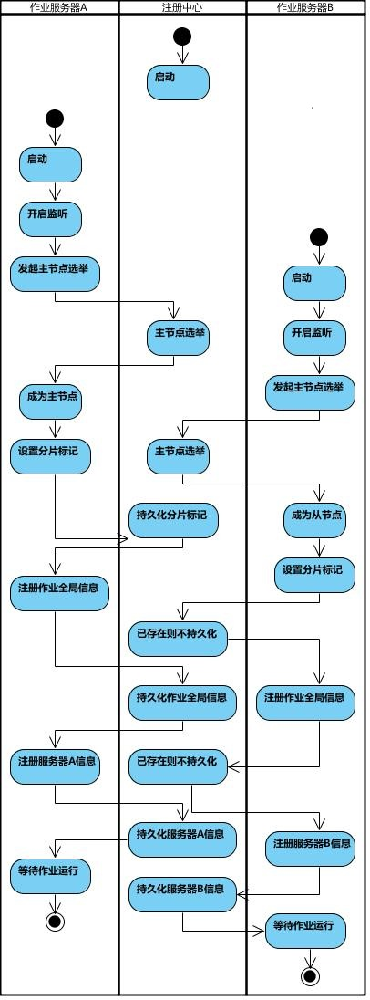
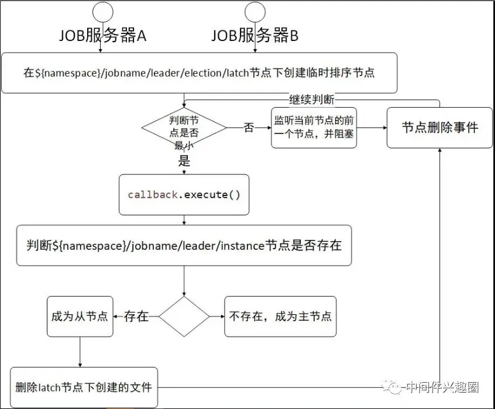

# 选主

作业启动时,执行选主流程


## 选主流程的实现 LeaderService

executeInLeader: 通过分布式锁的方式, 选择出一个节点执行  `callback()`, 分布式锁节点为：`{jobName }/leader/election/latch`

```java
    /**
 * Elect leader.
 * 选主逻辑
 */
public void electLeader() {
    log.debug("Elect a new leader now.");
    jobNodeStorage.executeInLeader(LeaderNode.LATCH, new LeaderElectionExecutionCallback());
    log.debug("Leader election completed.");
}

```

LeaderElectionExecutionCallback:

```java

@RequiredArgsConstructor
class LeaderElectionExecutionCallback implements LeaderExecutionCallback {

    @Override
    public void execute() {
        // 判断主节点是否已存在
        if (!hasLeader()) {
            // 创建一个临时节点: `{jobName}/leader/election/instance`, value = instance_id
            jobNodeStorage.fillEphemeralJobNode(LeaderNode.INSTANCE,
                    JobRegistry.getInstance().getJobInstance(jobName).getJobInstanceId());
        }
    }
}
```

作业主节点的选举过程比较简单， 就是争抢分布式锁的过程, 谁先抢到分布式锁, 谁就是可以升级为主节点.


## 监听器

## LeaderElectionJobListener

```java

    /**
     * 主要是当主节点宕机后触发重新选主监听器。
     * 监听节点 `/{jobName}/leader/election/instance`
     */
    class LeaderElectionJobListener implements DataChangedEventListener {

        @Override
        public void onChange(final DataChangedEvent event) {
            // job 未停止 && 当前服务器不是主节点 || instance 节点被删除时
            if (!JobRegistry.getInstance().isShutdown(jobName)
                    && (isActiveElection(event.getKey(), event.getValue())
                    || isPassiveElection(event.getKey(), event.getType()))) {
                leaderService.electLeader();
            }
        }

        /**
         * leader节点不存在
         *   && 当前服务器运行正常(运行正常的依据是存在{jobName}/servers/serverip)
         *   && 节点内容不为DISABLED
         * @param path
         * @param data
         * @return
         */
        private boolean isActiveElection(final String path, final String data) {
            return !leaderService.hasLeader() && isLocalServerEnabled(path, data);
        }

        /**
         * 如果当前事件节点为 `/{jobName}/leader/election/instance` 并且事件类型为删除
         *  && 该job的当前对应的实例(/{jobName}/instances/ip)存在并且状态不为DISABLED。
         * @param path
         * @param eventType
         * @return
         */
        private boolean isPassiveElection(final String path, final Type eventType) {
            JobInstance jobInstance = JobRegistry.getInstance().getJobInstance(jobName);
            return !Objects.isNull(jobInstance)
                    && isLeaderCrashed(path, eventType)
                    && serverService.isAvailableServer(jobInstance.getServerIp());
        }

        private boolean isLeaderCrashed(final String path, final Type eventType) {
            return leaderNode.isLeaderInstancePath(path) && Type.DELETED == eventType;
        }

        private boolean isLocalServerEnabled(final String path, final String data) {
            return serverNode.isLocalServerPath(path) && !ServerStatus.DISABLED.name().equals(data);
        }
    } 
```


## LeaderAbdicationJobListener

```java

    /**
     * 主节点退位监听器.
     * 当通过配置方式在线设置主节点状态为disabled时, 需要删除主节点信息从而再次激活选主事件.
     */
    class LeaderAbdicationJobListener implements DataChangedEventListener {

        @Override
        public void onChange(final DataChangedEvent event) {
            if (leaderService.isLeader() && isLocalServerDisabled(event.getKey(), event.getValue())) {
                leaderService.removeLeader();
            }
        }

        private boolean isLocalServerDisabled(final String path, final String data) {
            return serverNode.isLocalServerPath(path) && ServerStatus.DISABLED.name().equals(data);
        }
    }
```

当在控制台将leader 节点置为 disabled,此时将主节点信息移除(`{jobName}/leader/election/instance`), 并再次触发选主

